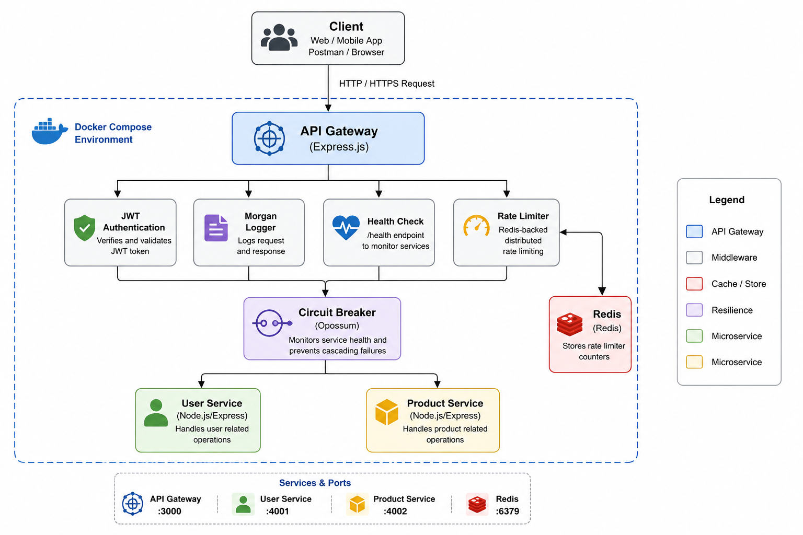

# 🚀 Mini API Gateway

A production-inspired API Gateway built with Node.js, Express, Redis, and Docker that demonstrates authentication, distributed rate limiting, circuit breaker, request logging, and microservice routing.


## 📖 Overview

Mini API Gateway is a production-inspired backend project demonstrating how modern microservices communicate securely and reliably.

The gateway authenticates incoming requests using JWT, protects services with Redis-backed distributed rate limiting, forwards traffic to independent microservices, and prevents cascading failures using a Circuit Breaker pattern.

The project is fully containerized using Docker Compose and includes CI using GitHub Actions.

## ✨ Features

- 🔐 JWT Authentication
- 🚦 Redis-backed Distributed Rate Limiting
- 🔄 Circuit Breaker (Opossum)
- 🌐 API Gateway using Express
- 🔀 Reverse Proxy for Microservices
- 📋 Morgan Request Logging
- ❤️ Health Check Endpoint
- 🐳 Docker & Docker Compose
- ⚙️ Environment Variable Configuration
- 🚀 GitHub Actions CI

## 🛠️ Tech Stack

| Category | Technology |
|-----------|------------|
| Runtime | Node.js |
| Framework | Express.js |
| Authentication | JWT |
| Rate Limiting | express-rate-limit + Redis |
| Circuit Breaker | Opossum |
| Logging | Morgan |
| HTTP Client | Axios |
| Cache | Redis |
| Containerization | Docker & Docker Compose |
| CI/CD | GitHub Actions |

## 📂 Folder Structure

```text
mini-api-gateway
│
├── gateway/
│   ├── config/
│   ├── middleware/
│   ├── circuitBreaker/
│   ├── controllers/
│   ├── server.js
│   └── package.json
│
├── user-service/
│
├── product-service/
│
├── .github/
│   └── workflows/
│
├── docker-compose.yml
└── README.md
```

## 🏗️ Architecture




## ⚙️ Installation

Clone the repository:

```bash
git clone https://github.com/ritesh2006-web/mini-api-gateway.git
cd mini-api-gateway
```

Install dependencies:

```bash
cd gateway && npm install
cd ../user-service && npm install
cd ../product-service && npm install
```

## 🐳 Run with Docker

```bash
docker compose up --build
```

The following services will start:

- API Gateway → localhost:3000
- User Service → localhost:4001
- Product Service → localhost:4002
- Redis → localhost:6379


## 🔑 Environment Variables

Create a `.env` file inside the gateway folder.

```env
PORT=3000

JWT_SECRET=your_secret

USER_SERVICE_URL=http://user-service:4001

PRODUCT_SERVICE_URL=http://product-service:4002

REDIS_URL=redis://redis:6379
```

## 📡 API Endpoints

| Method | Endpoint | Description |
|---------|----------|-------------|
| GET | /health | Health Check |
| GET | /user/profile | User Service |
| GET | /product/products | Product Service |

## 🔮 Future Improvements

- API Key Authentication
- Response Caching
- Service Discovery
- Kubernetes Deployment
- Prometheus Monitoring
- Grafana Dashboard

## 👨‍💻 Author

**Ritesh Puri**

GitHub: https://github.com/ritesh2006-web
